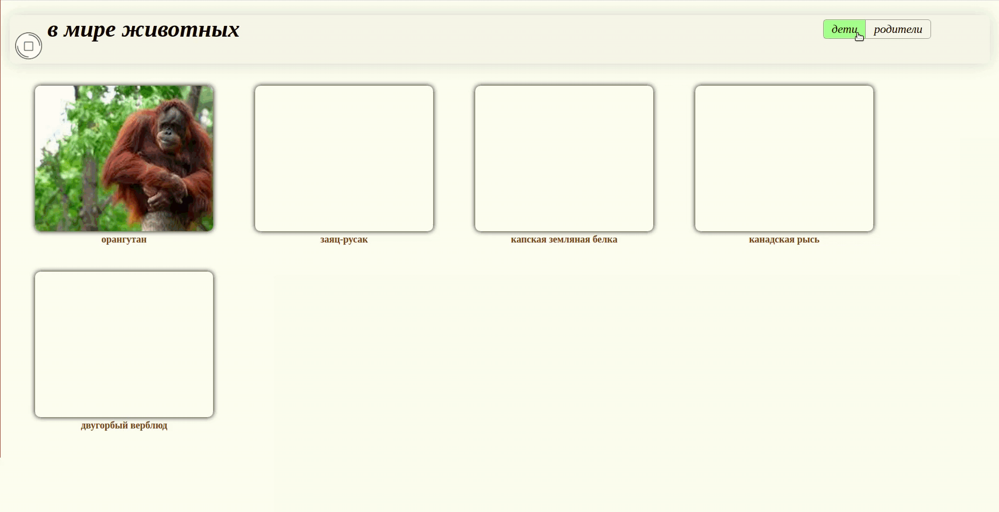
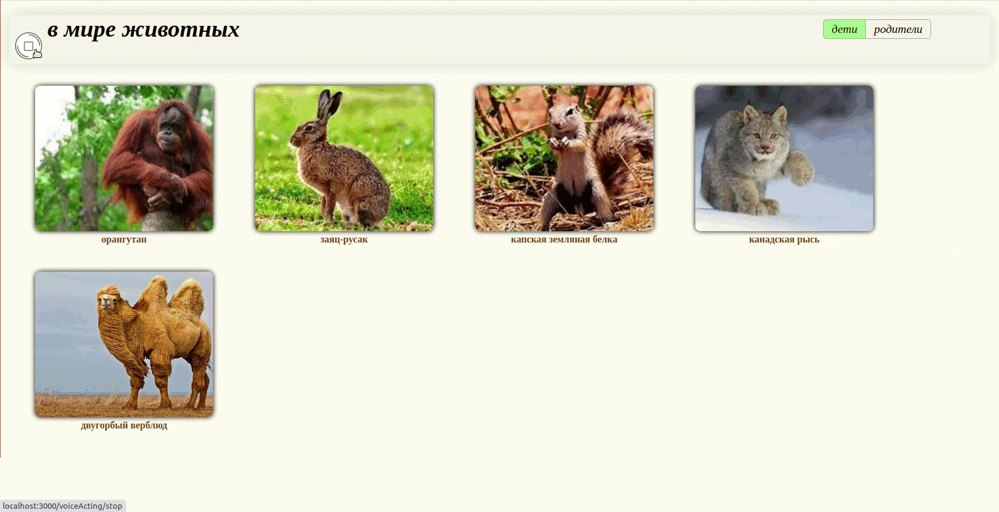

Приложение для обучение детей окружающему миру  

### Знакомство с окружающим миром:
Знакомство с окружающим миром в данном приложении можно осуществлять как визуально, так и на слух  
Нажав на любую из картинок можно прослушать звуковую дорожку текста описания.  

### Родительский контроль:
Родители могу контролировать набор объектов окружающего мира, которые может просматривать ребенок (добавляя новые объекты, редактируя или удаляя их).

Ссылка на видео работы приложения: https://youtu.be/UjjZE9bKX_c

### Над приложением работали:

* [Мария Богданова](https://github.com/Mariya-Bogdanova);
